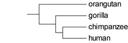

# TreeGradients

TreeGradients is a tree drawing program. The tree drawing options are fairly basic but the program has the ability to plot several types of continuous variables at the nodes in colors and use linear color gradients to fill the branches between nodes. The output format is SVG (scalable vector graphics), which can be imported in most vectorial drawing software.

The program has various applications. First, it can be used to plot continuous characters along a tree. Second, for ML ancestral state reconstructions of binary or three-state characters, the script can plot probabilities of the character states along the tree. I also find it useful to visualize topological uncertainty in phylogenetic trees by drawing poorly supported nodes in lighter shades of gray. This is especially useful to identify regions of bigger trees in which support is lacking.

The program does not reconstruct ancestral states; these have to be generated elsewhere. TreeGradients consists of two Perl scripts. The first script, TreeExtender.pl reads phylogenetic trees in Newick format and converts them to the phyloXML format. It can annotate the phyloXML file with results from ancestral state reconstruction software or user-specified values for ancestral nodes. The second script, TreeGradients.pl, plots the tree to a SVG file. An additional R script, ace2tg.R, can be used to save output obtained with the ace command from the R package ape in a format that can be easily read by TreeExtender.pl.

### Example output
Reconstructed states for minimum sea surface temperature plotted along a phylogenetic tree of 92 species of the marine green algal genus _Codium_.


Plotting character state probabilities of a fictitious three-state character using a triangle gradient.


Bootstrap support plotted in shades of gray. When applied to big trees, this method allows quick identification of regions in the tree with low support.


### Citation
If you find this software useful, please cite it in your work. I recommend citing it as follows:
Verbruggen H. (2012) TreeGradients version 1.03. https://github.com/hverbruggen/TreeGradients

### TreeExtender instructions
The program is a Perl script that must be run from the command-line. Its functionality must be controlled with command-line parameters.

##### Global parameters
```
-i    This option allows specifying the file containing the input tree(s). It is a required parameter.
-o    This option allows specifying an output filename. Output is always written in phyloXML format. 
      If no output filename is specified, the program will derive one from the input filename. 
-tf   This option allows specifying the format of the input file. These formats are supported:
      newick     Newick format, also known as New Hampshire format (parsed with BioPerl)
      phyloxml   The phyloXML format. Note that the parser in TreeExtender.pl doesn't support all phyloXML features.
-id   Allows specifying what identifiers of internal nodes in the Newick or Nexus input tree represent:
      id         Node identifiers represent names of internal nodes (e.g., higher taxa, protein families)
      bootstrap  Node identifiers represent bootstrap proportions
      posterior  Node identifiers represent posterior probabilities
```

##### Activating the ancestral character state parser
```
-p    Activate file parser for ancestral character states, specify which parser to use:
      list  list format (see below)
      mesq  Mesquite
      bt    BayesTraits
```

##### Options for parsing list files
```
-vt   Specify the type of variable you are parsing.
      continuous Ancestor states for a continuous variable
-f1   The file containing the list of character states for each node
-vn   Give a name to the character you're using (without spaces or weird characters). 
```
##### Options for parsing Mesquite files
```
-vt   Specify the type of file you're parsing:
      cont  Ancestor states for continuous characters inferred with the least squares MP option
      disc  Ancestor states for discrete (binary) characters inferred with ML
-f1   The file containing the Mesquite ancestral states output
-vn   Give a name to the character you're using (without spaces or weird characters). 
      If nothing is specified, TreeExtender will extract the variable from the Mesquite output.
```
##### Options for parsing BayesTraits files
```
-vt   Specify the type of file you're parsing:
      double_discrete   Ancestor states for two discrete variables inferred with the independent or interdependent models
      multistate        Ancestor states for a three-state variable inferred using the multistate model
-f1   The file containing the BayesTraits output
-f2   The file containing the data for terminal taxa (i.e., the input file used for BayesTraits)
-vn   Give a name to the character you're using (without spaces or weird characters). 
-jp   Converts probabilities of the double_discrete type to probabilities for a single, discrete character.
      This calculates the probabilities of state 0 and state 1 for the desired characters by summing across the 
      probabilities of both states for the other character.
      e.g., Pr (a = 1) = Pr (a = 1, b = 0) + Pr (a = 1, b = 1)
      1   Extracts the probabilities for the first character given as input to BayesTraits.
      2   Extracts the probabilities for the second character given as input to BayesTraits.
```

##### Format of list file
The list file contains ancestral character state values in a very straightforward format. It is a plain text file in which each line has a character value followed by a tab character and a list of the terminal taxa subtended by the node to which the character value applies. The list of terminal taxa must have a space character between each taxon. So, obviously, you're not supposed to have spaces in your taxon names. This easy list format allows users to come up with hypothetical ancestral values and plot them with TreeGradients. For example, states for all nodes in a rooted a four-taxon tree can be listed as follows:

Example tree:



Hypothetical list file for this tree:

```
4.13 orangutan
3.75 gorilla
2.15 chimpanzee
2.23 human
2.35 chimpanzee human
4.02 chimpanzee human gorilla
4.88 orangutan chimpanzee human gorilla
```

### TreeGradients instructions
The program is a Perl script that must be run from the command-line. Its functionality must be controlled with command-line parameters.

##### Global parameters
```
-t    File containing the input tree in phyloXML format. I strongly recommend using TreeExtender.pl to generate them.
-o    Output filename (SVG format)
```
##### Plotting gradients
```
-vn   Name of variable to plot. Usually the name given with -vn in TreeExtender, or one of these:
      bootstrap1    Uses the bootstrap values from the tree
      bootstrap2    Ditto, but values < 50 are given the color for 50
      posterior1    Uses the posterior probability values from the tree
      posterior2    Ditto, but values < 0.50 are given the color for 0.50
-co   Defines the color mode
      off       Don't use colors (branches will be plotted in black)
      gradient  Linear color gradient, ramping from color of stem node to color of crown node
      plain     Branches will be plotted in a plain color of node to which they lead
-gt   Gradient type. Two classes of gradients are implemented: linear for plotting continuous trait 
      or probabilities, and triangle gradients for probabilities of three-state traits.
      Linear gradients:
        royg     red – orange – yellow – green
        rainbow  red – orange – yellow – green – blue – indigo – violet
        bly      blue – yellow
        blw      blue – white
        blg      blue – green
        bw       black – white  (shades of gray)
        g[x-y]   shades of gray, from darkness x to darkness y
      Triangle gradients:
        byr      blue - yellow - red
        gyr      green - yellow - red
        gby      green - blue - yellow
        rgb      red - green - blue
-gr   Number of gradient stops along each branch. Lots of stops means smooth color gradients at the
      expense of file size. Unless your characters change very rapidly, 5 stops will usually suffice.
-lo   Use this option to specify how the gradient legend should be drawn.
      h   horizontal
      v   vertical
```
##### Plotting labels
```
-pt   Determines whether or not you want to plot the names of terminal taxa.
      0  Don't plot them
      1  Plot them
-ni   Plot one of the following labels at internal nodes.
      nodeID   Plots node IDs (these are usually support values)
      value    Plot the value of the variable that is plotted on the tree at the node in question
      none     Don't plot any values at nodes
-nd   Number of decimals to plot for internal node labels.
```
##### Optional parameters for square trees
```
-re   If this option is activated, the edges of the branches are rounded.
      0  Straight edges
      1  Round edges
-bs   This option allows you to set the branch spacing (in mm).
-bw   This option allows you to set the branch width (in mm).
-bs   This option allows you to set the heigth-width ratio of the tree.
```

### ace2tg.R instructions
The program is a R function that must be called from within R. The following three lines of R code show how to use it.
```
source("ace2tg.R")
anc <- ace(var, phy, type = "continuous", method = "ML")
ace2tg(anc, phy, var, file = "output.txt")
```
The first line reads the file ace2tg.R, which puts the function ace2tg into memory. The second line does the ancestral state estimation of a continuous variable (var) along a phylogeny (phy) and stores the result in a new variable (anc). The third line calls the function ace2tg, passes it the ace output (anc), the phylogeny (phy) and the original variable (var). The function saves the list file to output.txt.

### Examples provided

These instructions illustrate how to run the program on the example files provided. 

##### Example 1.1 – Plotting bootstrap values
This example shows how to plot bootstrap values onto a tree as branch colors. The input tree file is in newick format and has the bootstrap values defined as nodeIDs.

```reds.nwk	file containing the tree with bootstrap values (in newick format)```

The newick file has to be converted to the phyloXML format in order to be able to draw it. This is done with TreeExtender.pl using the following command:

```perl TreeExtender.pl -i reds.nwk -id bootstrap```

The newick file is specified as input with the -i switch and the program is informed that nodeIDs are posterior probabilities with the -id posterior switch. This command generated the codium_tree.xml file, which is the tree in XML format. This file will be used as input for the TreeGradients.pl script, which will draw the tree. Here's an example command to create an SVG drawing of the tree.

```perl TreeGradients.pl -t reds.xml -o reds_bootstrap.svg -vn bootstrap1 -ni bootstrap -gt blw -gr 1```
The -t and -o switches specify the input phyloXML tree and the output SVG files. The program is told to plot bootstrap values on the branches (-vn bootstrap1) according to a blue-white color gradient (-gt blw). Bootstrap values are also printed at nodes using the -ni bootstrap switch. Any gradient going from white to another color does not benefit from a gradient resolution above 1 so, in order to reduce file size, I set the gradient resolution to its minimum value (-gr 1). Running this command created the reds_bootstrap.svg file, which contains the tree drawing and can be opened with most vectorial drawing software.

##### Example 1.2 – Plotting posterior probabilities
This example shows how to plot posterior probabilities onto a tree as branch colors. I ran an analysis with MrBayes v.3.1.2 and generated a .con file with the sumt command. I opened this file in a text editor, copied the first tree (the one with PP values), pasted it into a new file and saved it as a newick file.

```
codium_tree.con	.con file from MrBayes output (in nexus format)
codium_tree.nwk	file containing the tree with PP values (in newick format)
```

The newick file has to be converted to the phyloXML format in order to be able to draw it. This is done with TreeExtender.pl using the following command:

```perl TreeExtender.pl -i codium_tree.nwk -id posterior```
The newick file is specified as input with the -i switch and the program is informed that nodeIDs are posterior probabilities with the -id posterior switch. This command generated the codium_tree.xml file, which is the tree in XML format. This file will be used as input for the TreeGradients.pl script, which will draw the tree. I'll tell the program to draw the posterior probabilities along the tree in shades of gray.

The -t and -o switches define the input tree and output SVG. The -vn posterior2 switch tells the program to convert the posterior probabilities to a gradient of colors (in this case, shades of gray). Because one is not usually interested in very low PP values, the posterior2 option allows drawing PPs below 0.50 in the shade of gray corresponding to PP = 0.50, not wasting "gradient space" on very low PP values. The gradient runs from 0.2 to 1 darkness, as specified by the switch -gt g[0.2-1]. Because grayscale gradients don't need internal stops, I set the gradient resolution to 1 (-gr 1) to decrease SVG file size. I also told the program to print the posterior probability at internal nodes (-ni posterior).

##### Example 2.1 – Plotting BayesTraits output: joint analysis of two discrete characters
This example shows how to plot ancestral state probabilities of discrete characters onto a tree. I will use a dataset containing two characters and use BayesTraits' discrete independent model for the ancestral state reconstruction (independent folder), but it will also work with the interdependent model (interdependent folder). I'm using a green algal dataset in this example. The two discrete characters that I'm interested in are (1) the presence of flagella in the vegetative life stage, and (2) whether the vegetative life stage is uni- or multicellular. We start from the situation before the BayesTraits analysis. Here's an overview of the input files:

```
green_data.txt	Data file containing the character states for all terminal taxa, formatted for BayesTraits.
green_tree.nwk	Phylogenetic tree of the taxa, in Newick format.
green_tree.nex	Phylogenetic tree of the taxa, in Nexus format.
bt_script.txt	To make things easier, I generated a script file to run BayesTraits. This file contains all the BayesTraits commands that would otherwise have to be typed, including a specification of the type analysis to run and definitions of all internal nodes in the tree. These definitions can easily be generated using one of my Perl scripts. Send me an email if you're interested.
```

The first thing to do is run BayesTraits to reconstruct ancestral states for all internal nodes. This is done as follows:

```bayestraits green_tree.nex green_data.txt < bt_script.txt```
This command gives you a bunch of screen output and also generates the file green_data.txt.log.txt

Now suppose I'm interested in plotting the probabilities of the first character on the tree. In order to do this, the the tree file needs to be converted into phyloXML format and annotated with the appropriate character state probabilities. This is done with the following TreeExtender.pl command.

```perl TreeExtender.pl -i green_tree.nwk -o green_tree.xml -p bt -f1 green_data.txt.log.txt -f2 green_data.txt -vt double_discrete -jp 1 -vn flagella```
The -i and -o switch specify input and output tree files. The -p switch is used to run the BayesTraits parser, using -f1 and -f2 to specify the data files. The -vt switch tells the program to expect double_discrete data, i.e., data resulting from the analysis of two discrete characters. The -jp switch is used to let the program know I'm interested in the first character. I used the -vn switch to specify a variable name: flagella (the first variable in my example is the presence of flagella in the vegetative stage of the life cycle). After the script is run you'll find the phyloXML file green_tree.xml.

Now you're ready to plot the values on the tree with TreeGradients.pl. Here's a simple example of how to do this, using default settings for all optional parameters.

```perl TreeGradients.pl -t green_tree.xml -o flagella.svg -vn flagella```

This generated the flagella.svg file. The color gradient runs from 0 (green) to 1 (red) and indicates the probability of having character state 1 (in this case the probability of having a flagella in the vegetative life stage). The SVG file can be opened in most vectorial drawing software.

Now suppose we also need to visualize the states of the second character. In order to do this, we must run TreeExtender.pl again to annotate the phyloXML file with the states of the second character.

```perl TreeExtender.pl -i green_tree.xml -tf phyloxml -o green_tree_2.xml -p bt -f1 green_data.txt.log.txt -f2 green_data.txt -vt double_discrete -jp 2 -vn multicellular```

This command opens the phyloXML file green_tree.xml, appends the character states for the second character (-jp 2) and writes the result to green_tree_2.xml. Now both characters (flagella and multicellular) are present in the green_tree_2.xml file. This command visualizes the probability that the vegetative life stage is multicellular in a blue-to-yellow gradient.

```perl TreeGradients.pl -t green_tree_2.xml -o multicellular.svg -vn multicellular -gt bly```
This command generates the file multicellular.svg, which contains the tree drawing.

The same modus operandi can be used with BayesTraits' model for interdependent evolution between two binary characters. The exercise has been repeated with the interdependent model in the interdependent folder. The only difference is in the bt_script.txt file.

##### Example 2.2 – Plotting BayesTraits output: multistate analysis of three-state characters
This example shows how to plot ancestral state probabilities of three-state characters onto a tree. I will use a fictitious dataset containing a single three-state character and use BayesTraits' multistate model for the ancestral state reconstruction. We start from the situation before the BayesTraits analysis. Here's an overview of the input files:

```
character_data.txt	Data file containing the character states for all terminal taxa, formatted for BayesTraits.
tree.nwk	Phylogenetic tree of the taxa, in Newick format.
tree.nex	Phylogenetic tree of the taxa, in Nexus format.
bt_commands.txt	To make things easier, I generated a script file to run BayesTraits. This file contains all the BayesTraits commands that would otherwise have to be typed, including a specification of the type analysis to run and definitions of all internal nodes in the tree. These definitions can easily be generated using one of my Perl scripts. Send me an email if you're interested.
```

The first thing to do is run BayesTraits to reconstruct ancestral states for all internal nodes. This is done as follows:

```bayestraits tree.nex character_data.txt < bt_commands.txt```

This command gives you a bunch of screen output and also generates the file character_data.txt.log.txt. Next thing to do is to convert the tree to phyloXML and annotate the BayesTraits output. This is done as follows:

```perl TreeExtender.pl -i tree.nwk -o tree.xml -p bt -f1 character_data.txt.log.txt -f2 character_data.txt -vt multistate -vn btt```
This command results in the file character_data.txt.log.txt being generated. The tree can now be plotted using TreeGradients.pl:

```perl TreeGradients.pl -t tree.xml -o plot.svg -vn btt -ni value -gt byr -gr 3```
For plotting three-state characters, one of the triangle gradient types has to be used. Each of the triangular gradients are defined by three letters representing the colors for each state. Intermediate colors indicate uncertainty. In this example, I used the byr (blue-yellow-red) gradient type. Execution of the command generates the file plot.svg, which contains the tree drawing.

### Dependencies
TreeExtender and TreeGradients are Perl programs that require you have a recent version of Perl installed, as well as the following libraries that can be obtained from CPAN:
* BioPerl bundle
* Graphics::ColorUtils
* IO::File
* Math::Trig
* Sort::Array
* SVG
* XML::DOM
* XML::Writer

### Notes and disclaimer
TreeGradients is in development and has not been tested extensively. It is quite plausible that incorrectly formatted input could lead to nonsensical output. In such cases, you should double-check your input, compare it to the example files and try again. If this still doesn't work, please feel free to write me an email: heroen.verbruggen@gmail.com.